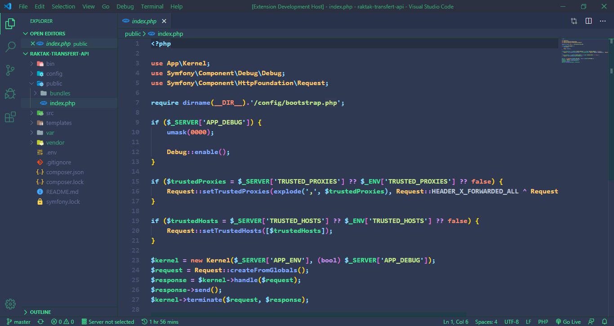
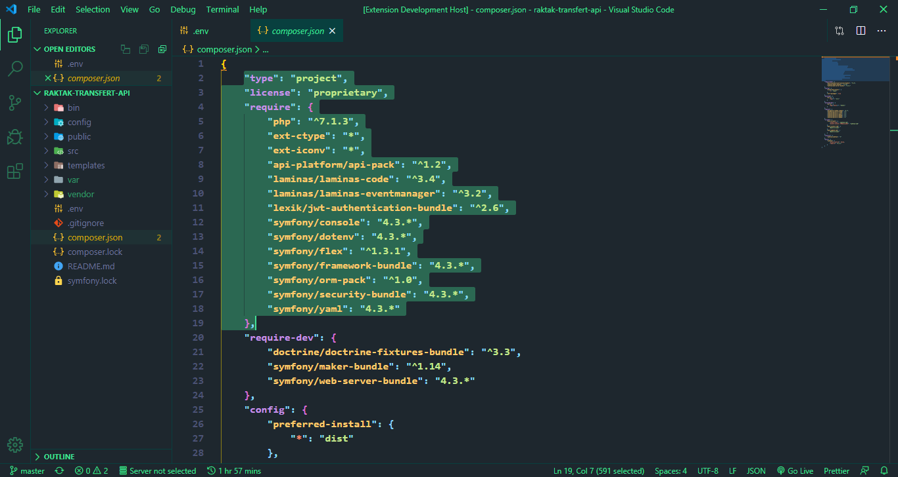

# Taarú
A nice theme with Senegalese beauty, for coding the world. 

# Author
Created by **[Daouda BA](https://github.com/daoodaba975)** from **[Senegal](https://goo.gl/maps/gYi1X5wo8AdwSM2C9)** 
Follow me on **[Twitter](https://twitter.com/daoodaba975)** 
You can buy me a coffee **[here](https://buymeacoffee.com/daoodaba975)** and help the project to grow up 🙌🏾

# Screenshots
 

## Installation
1. Open the **Extensions** sidebar in VS Code. `View → Extensions`
2. Search for `Taarú`, choose **Taarú** by **Daouda BA**
3. Click **Install** to install it
4. Navigate to File > Preferences > Color Theme > **Taarú** or any of the variants listed
5. And enjoy it 👌🏾

## Contributing
Found something strange🤔 new functionality suggestion or more 
You can tell me **[here](https://github.com/daoodaba975/taaru/issues)** 👨🏾‍💻 
Also, you might want to check out the **[Contributing Guide](https://github.com/daoodaba975/taaru/blob/master/Contributing.md)** 🤝🏾

### License
This theme is released under the **[MIT License](https://github.com/daoodaba975/taaru/blob/master/License.md)** ✔

**Enjoy!** 🙏🏾