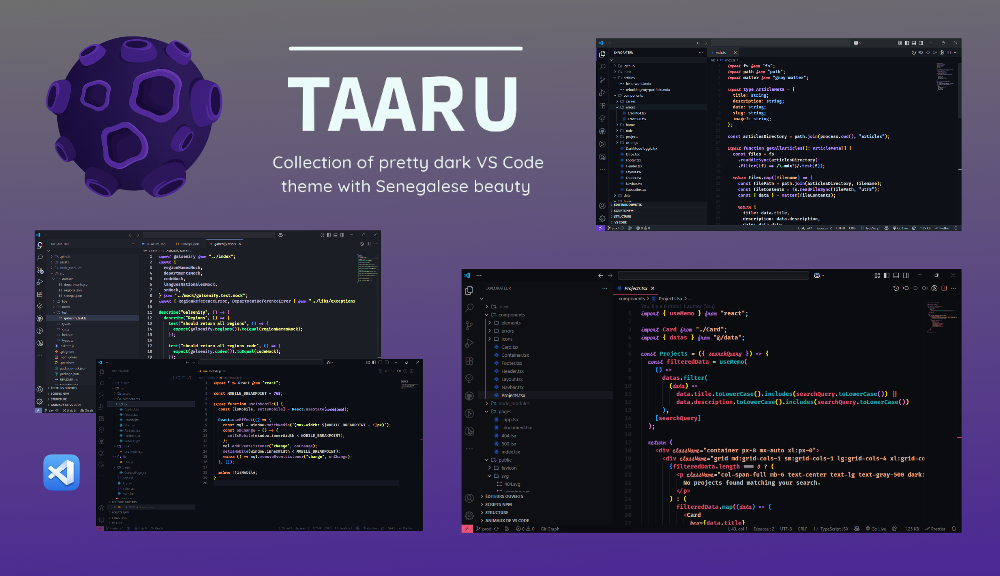

# Taaru 🎨

## Screenshot 🖼️

## Installation 📥

1. Open the `Extensions` sidebar in VS Code. `View → Extensions`
2. Search for `Taaru`, choose **Taaru** by **Daouda BA**
3. Click `Install` to install it
4. Navigate to `File` > `Preferences` > `Color Theme` > `Taaru` or any of the variants listed
5. And enjoy it 👌🏾

## Author 🌟

Taaru VS Code Theme crafted by **[Daouda BA](https://github.com/daoodaba975)**, you can support this project by making a donation **[here](https://www.buymeacoffee.com/daoodaba975)**.

### Contributing 🌍

New functionality suggestion or more..  
You can tell me **[here](https://github.com/daoodaba975/taaru/issues)** or on **[X (Twitter)](https://x.com/daoodaba975)** 🙌🏾

Also, you might want to check out the **[Contributing Guide](assets/CONTRIBUTING.md)** 🤝🏾

Thanks to all contributors 👏🏽

You can also check the **[Changelog](assets/CHANGELOG.md)** to see the different changes and evolution between versions.

### License 🎫

This theme is released under the **[MIT License](assets/LICENSE.md)** ✔

**Enjoy!** 🙏🏾
